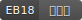
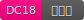
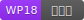
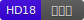

# Dimibadge
각종 문서에서 사용하기 위한 한국디지털미디어고등학교 배지입니다.

과별 색상은 한국디지털미디어고등학교 나무위키 문서의 [학과](https://namu.wiki/w/한국디지털미디어고등학교#s-4) 항목의 색을 사용했습니다.

## Badges with department and admission year
학생의 학과와 입학년도가 나타나는 배지입니다.

### Request

`/{dpt}/{year}`

| parameter | method | description |
|:----------|:-------|:------------|
| `dpt`     | `URL`  | 학과(대소문자에 상관없이 `eb`, `dc`, `wp`, `hd` 중 하나) |
| `year`    | `URL`  | 입학년도(기수) |
| `base`    | `GET`  | 과별 색상 왼쪽의 학과 필드 색(기본값은 `#555`), `#` 없이 전달 |

## Badges with name
학생의 학과와 입학년도, 이름이 나타나는 배지입니다.

### Request

`/{dpt}/{year}/{name}`

| parameter | method | description |
|:----------|:-------|:------------|
| `dpt`     | `URL`  | 학과(대소문자에 상관없이 `eb`, `dc`, `wp`, `hd` 중 하나) |
| `year`    | `URL`  | 입학년도(기수) |
| `name`    | `URL`  | 이름 |
